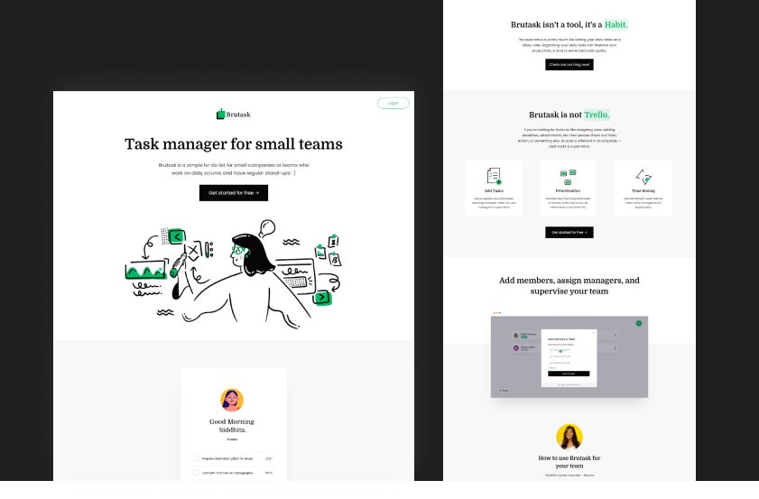
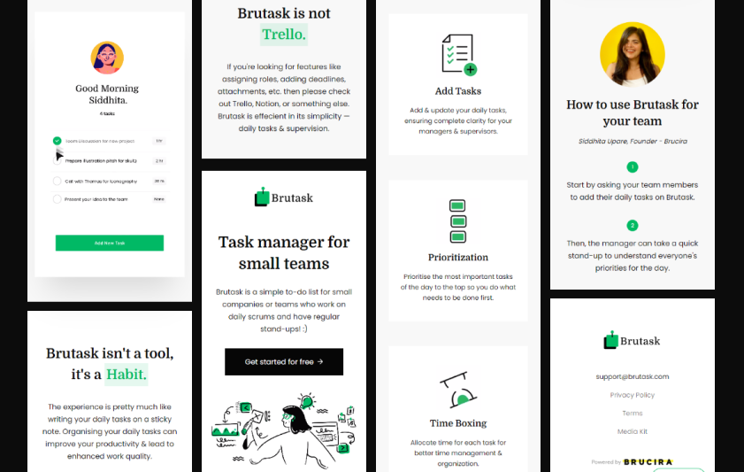

# Brutask Task Manager

   

I love to clone Brutask's interface since it has a neat and clean look.  
Mine doesn't look 100% the same as the original because I made a few changes to some elements.

## Link
* [Brutask's here](https://brutask.com)  
* [Mine here](https://faraaiden-brutask-ui-clone.netlify.app/)

## Built with

- Semantic HTML5 markup
- S(CSS)
- Mobile-first workflow

*Note: I think I forgot to add some transitions 😅 I'll fix it!*
